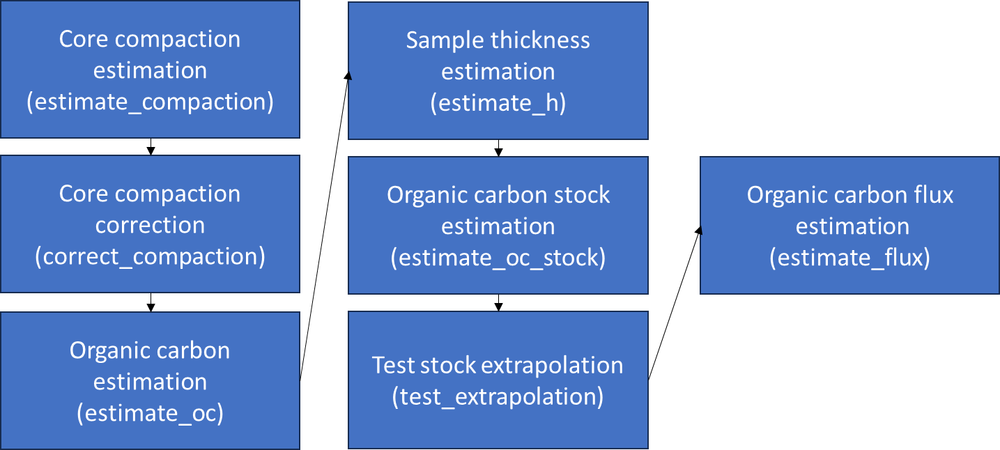

<!-- README.md is generated from README.Rmd. Please edit that file -->

# BlueCarbon

<!-- badges: start -->

[](https://github.com/EcologyR/templateRpackage/actions/workflows/R-CMD-check.yaml)
[](https://app.codecov.io/gh/EcologyR/templateRpackage?branch=master)
[](https://lifecycle.r-lib.org/articles/stages.html#experimental)
[](https://www.repostatus.org/#wip)
\< !–
[](https://www.codefactor.io/repository/github/ecologyr/templaterpackage)
– \>

<!-- badges: end -->

The goal of BlueCarbon is to facilitate the estimation of organic carbon
stocks and fluxes from soil/sediment cores from blue carbon ecosystems.
It contains seven main functions to estimate the compression of cores,
mathematically correct core compression, estimate sample thickness,
estimate organic carbon content from organic matter content, estimate
organic carbon stocks fluxes and visualize the error of stock
extrapolation.

<figure>

<figcaption aria-hidden="true">Diagram of BlueCarbon main
functions</figcaption>
</figure>

Organic carbon content estimation from organic carbon data: estimate_oc

There is linear correlation between organic carbon and organic matter
content. This correlation can change between ecosystems and sampling
sites due to changes in organic matter composition among other factors.
This function model a linear correlation between organic matter and
organic carbon content in your samples and predict the content of
organic carbon for those samples were there is no organic carbon values.
Estimation of organic carbon is done by means of linear regressions on
log(organic carbon) ~ log(organic matter). It gives back a organic
carbon value for each organic matter value provided. If there is a
organic carbon value for that sample it return the same value, else,
generates a model for that site, else, model for specie, else, model for
that ecosystem. If a model can not be created due to the low number of
samples (\<10) it uses the equations in Howard et al. 2014 (obtained
from Craft et al. 1991, Fourqurean et al. 2012 and Kaufmann et al. 2011)
to estimate the organic carbon. It is unlikely, but possible, that a
model will predict a higher organic carbon tn organic matter content.
This is not possible in nature. If this is the case the function will
give a warning and it is recommended to discard that model.

Howard, J. et al. Coastal Blue Carbon methods for assessing carbon
stocks and emissions factors in mangroves, tidal salt marshes, and
seagrass meadows. Habitat Conservation (2014).

Craft, C. B., Seneca, E. D. & Broome, S. W. Loss on ignition and
kjeldahl digestion for estimating organic carbon and total nitrogen in
estuarine marsh soils: Calibration with dry combustion. Estuaries 14,
175–179 (1991).

Fourqurean, J. W. et al. Seagrass ecosystems as a globally significant
carbon stock. Nat. Geosci. 5, 505–509 (2012).

Kauffman, J. B., Heider, C., Cole, T. G., Dwire, K. A. & Donato, D. C.
Ecosystem carbon stocks of micronesian mangrove forests. Wetlands 31,
343–352 (2011).

Sample thickness estimation: estimate_h

For those cores were only selected samples were measured it is necessary
to assign a carbon density to the empty spaces before the estimation the
total stock. This function checks for gaps between samples and, if any,
divide this space between the previous and next sample to return sample
thickness without gaps in the core. The stock and flux estimation
functions (estimate_oc_stock and estimate_flux) have this function
incorporated and it is not necessary to run it before.

Organic carbon stock estimation: estimate_oc_stock

Estimates carbon stocks from soil core data down to a specified depth,
100 cm by default. If the core does not reach the desired depth, it
extrapolates the stock from a linear model between accumulated mass of
organic carbon and depth.

Visualize the error of stock extrapolation: test_extrapolation

This function subset those cores that reach the desired depth, estimates
the stock (observed stock), estimate the stock from the linear relation
of organic carbon accumulated mass and depth using the 90, 75, 50 and
25% top length of the indicated desired depth. Compares the observed
stock with the estimated stocks by extrapolation. This function
requieres that some of you core do reach the desired depth.

Organic carbon flux estimation: estimate_flux

Estimate the average organic carbon flux to the soil in a indicated time
frame (by default last 100 years) from the organic carbon concentration
and ages obtained from a age-depth or age-accumulated mass models
(provided by the user).

## Installation

``` r
# install.packages("devtools")
devtools::install_github("EcologyR/templateRpackage")
```

The code to create this package is available
[here](https://gist.github.com/Pakillo/999e34301c56011138ef164363502465).

## Example

This is a basic example which shows you how to solve a common problem:

``` r
# library(templateRpackage)
## basic example code
```

What is special about using `README.Rmd` instead of just `README.md`?
You can include R chunks like so:

``` r
summary(cars)
#>      speed           dist       
#>  Min.   : 4.0   Min.   :  2.00  
#>  1st Qu.:12.0   1st Qu.: 26.00  
#>  Median :15.0   Median : 36.00  
#>  Mean   :15.4   Mean   : 42.98  
#>  3rd Qu.:19.0   3rd Qu.: 56.00  
#>  Max.   :25.0   Max.   :120.00
```

You’ll still need to render `README.Rmd` regularly, to keep `README.md`
up-to-date. `devtools::build_readme()` is handy for this. You could also
use GitHub Actions to re-render `README.Rmd` every time you push. An
example workflow can be found here:
<https://github.com/r-lib/actions/tree/v1/examples>.

You can also embed plots, for example:

``` r
plot(pressure)
```

In that case, don’t forget to commit and push the resulting figure
files, so they display on GitHub and CRAN.

## Citation

If using this package, please cite it:

``` r
#citation("BlueCarbon")
```

## Funding

The development of this software has been funded by Fondo Europeo de
Desarrollo Regional (FEDER) and Consejería de Transformación Económica,
Industria, Conocimiento y Universidades of Junta de Andalucía (proyecto
US-1381388 led by Francisco Rodríguez Sánchez, Universidad de Sevilla).


