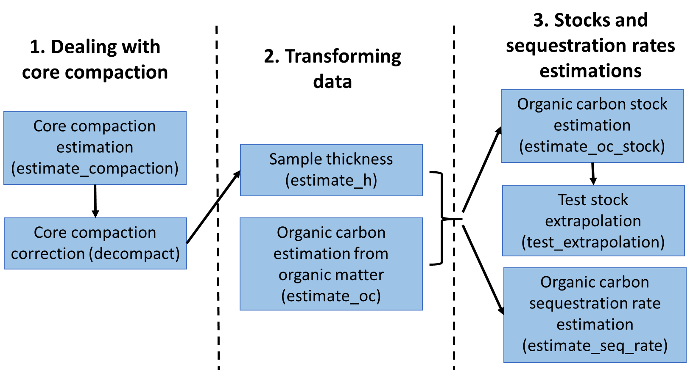
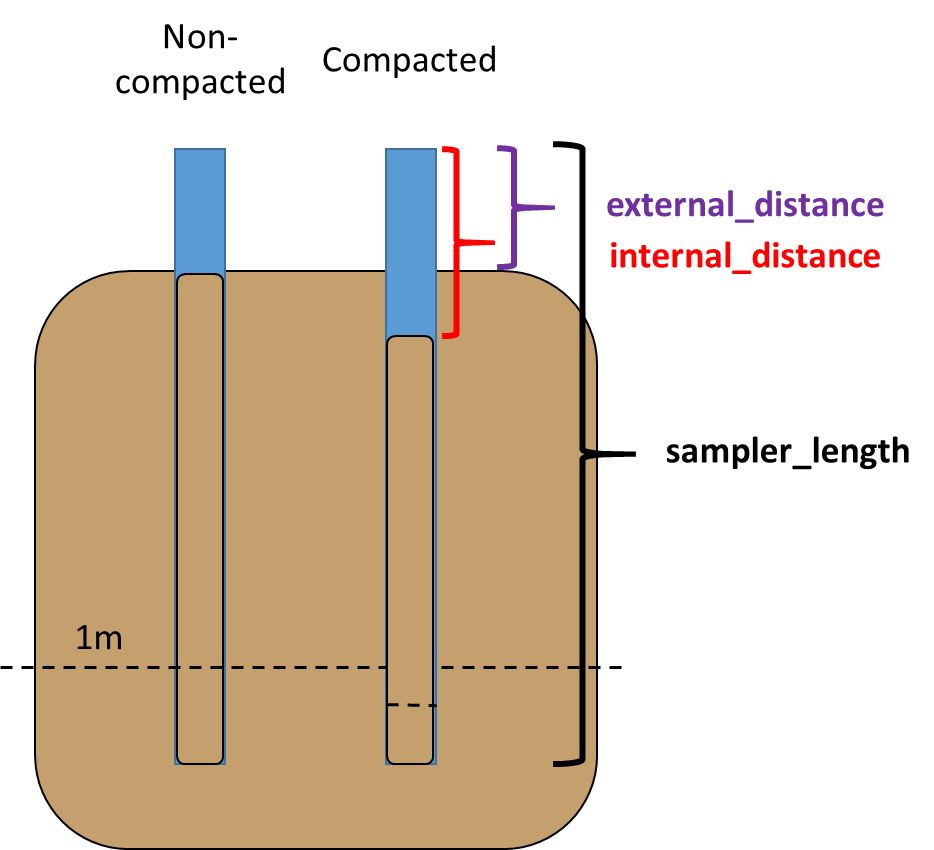
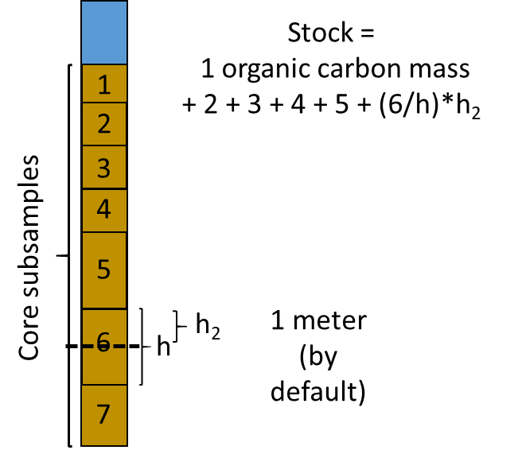

<!-- README.md is generated from README.Rmd. Please edit that file -->

# BlueCarbon

<!-- badges: start -->

[](https://cran.r-project.org/package=BlueCarbon)

[](https://github.com/EcologyR/BlueCarbon/actions/workflows/R-CMD-check.yaml)
[](https://app.codecov.io/gh/EcologyR/BlueCarbon)
[](https://lifecycle.r-lib.org/articles/stages.html#stable)
[](https://www.repostatus.org/#active)
[](https://cran.r-project.org/package=BlueCarbon)

<!-- badges: end -->

The goal of BlueCarbon is to facilitate the estimation of organic carbon
stocks and sequestration rates from soil/sediment cores from blue carbon
ecosystems.

It contains seven main
[functions](https://ecologyr.github.io/BlueCarbon/reference/index.html)
to deal with core compaction (estimate and correct for the compaction of
cores when sampling), transform laboratory data (estimate sample
thickness and estimate organic carbon content from organic matter
content) and estimate organic carbon stocks and sequestration rates
(estimate organic carbon stocks and sequestration rates and visualize
the error of stock extrapolation).

<figure>

<figcaption aria-hidden="true">BlueCarbon library workflow</figcaption>
</figure>

#### ***estimate_compaction*** **- Estimate Core Compaction**

Sampling soil cores by manual percussion usually leads to the compaction
of the material retrieved. This function will estimate the percentage of
compaction from measurements taken in the field after inserting the
corer tube and before extracting it: length of the corer tube
(sampler_length), distance between the surface of the soil and the top
of the tube in the outside (external_distance) and distance between the
surface of the soil and the top of the tube in the inside of the tube
(internal_distance).

<figure>

<figcaption aria-hidden="true">Soil compaction from field
sampling</figcaption>
</figure>

#### ***decompact*** **- Calculate sediment properties after decompaction**

Core compaction derived from field extraction can be mathematically
corrected to estimate the original depth of the samples. This function
will apply a linear correction (all the core material is assumed to have
been compacted equally) to correct sample depth and, if provided, dry
bulk density.

#### ***estimate_oc*** **- Organic carbon content estimation from organic carbon data**

Typically the relationship between organic carbon and organic matter
content can be modelled with a linear regression model. This
relationship can change between ecosystems and sampling sites due to
changes in organic matter composition among other factors. This function
(`estimate_oc()`) fits a linear model between organic matter and organic
carbon content in your samples to estimate the content of organic carbon
in those samples lacking those values. The estimation of organic carbon
is done by means of linear regressions on log(organic carbon) ~
log(organic matter). If there is a value for organic carbon for that
sample it returns the same value; otherwise, it estimates organic carbon
from a model fitted to that site, or a model fitted to that species, or
else a model fitted to that ecosystem. If there are too few samples to
build a reliable model or the model fit is too poor,`estimate_oc()` uses
the equations in [Fourqurean et
al. (2012)](https://doi.org/10.1038/ngeo1477) for seagrasses, [Maxwell
et al. (2023)](https://doi.org/10.1038/s41597-023-02633-x) for salt
marshes and Piñeiro-Juncal (in prep.) for mangroves to estimate the
organic carbon. It is unlikely, but possible, that a model predicts
higher organic carbon than organic matter content. As this is not
possible in nature, the function will give a warning and it is
recommended to discard that model.

#### ***estimate_h*** **- Sample thickness estimation**

For those cores where only selected samples were measured it is
necessary to assign a carbon density to the empty spaces to estimate the
total stock. This function (`estimate_h()`) checks for gaps between
samples and, if any, divides this space between the previous and next
sample to return sample thickness without gaps in the core. The middle
point between one sample and the other is estimated from the bottom of
the previous sample to the top of the next sample, and not from the
middle point of one sample to the middle part of the next, as this would
unequally distribute the gaps between samples if the samples have
different thickness. The stock and sequestration rate estimation
functions (`estimate_oc_stock()` and `estimate_seq_rate()`) have this
function incorporated and it is not necessary to run it beforehand.

<figure>

<figcaption aria-hidden="true">Gap distribution between samples to
estimate accumulated organic carbon mass.</figcaption>
</figure>

#### ***estimate_oc_stock*** **- Organic carbon stock estimation**

Estimates carbon stocks from soil core data down to a specified depth,
100 cm by default. If the core does not reach the desired depth, it
extrapolates the stock from a linear model between accumulated mass of
organic carbon and depth.

<figure>

<figcaption aria-hidden="true">OC stock estimation diagram</figcaption>
</figure>

#### ***test_extrapolation*** **- Visualize the error of stock extrapolation**

This function subset those cores that reach the desired depth, estimates
the stock (observed stock), estimates the stock from the linear relation
of organic carbon accumulated mass and depth using the 90, 75, 50 and
25% top length of the indicated desired depth, and compares the observed
stock with the estimated stocks by extrapolation. This function requires
that some of your cores do reach the desired depth.

#### ***estimate_seq_rate*** **- Organic carbon sequestration rates estimation**

Estimate the average organic carbon sequestration rate in the soil in a
given time frame (by default last 100 years) from the organic carbon
concentration and the age of the samples.

## Installation

BlueCarbon can be installed directly from
[CRAN](https://cran.r-project.org/package=BlueCarbon):

``` r
install.packages("BlueCarbon")
```

or from [R-universe](https://ecologyr.r-universe.dev/BlueCarbon):

``` r
install.packages("BlueCarbon", repos = c("https://ecologyr.r-universe.dev", "https://cloud.r-project.org"))
```

Or from [GitHub](https://github.com/EcologyR/BlueCarbon):

``` r
# install.packages("remotes")
remotes::install_github("EcologyR/BlueCarbon")
```

## Citation

If using this package, please cite it:

``` r
citation("BlueCarbon")
To cite package 'BlueCarbon' in publications use:

  Piñeiro-Juncal N, Astigarraga J, Costa V, Martins M,
  Rodriguez-Sanchez F (2025). _BlueCarbon: Estimation of Organic Carbon
  Stocks and Sequestration Rates From Soil Core Data_. R package
  version 0.1.0, https://EcologyR.github.io/BlueCarbon/,
  <https://github.com/EcologyR/BlueCarbon>.

A BibTeX entry for LaTeX users is

  @Manual{,
    title = {BlueCarbon: Estimation of Organic Carbon Stocks and Sequestration Rates From Soil Core Data},
    author = {Nerea Piñeiro-Juncal and Julen Astigarraga and Valentina Costa and Marcio Martins and Francisco Rodriguez-Sanchez},
    year = {2025},
    url = {https://github.com/EcologyR/BlueCarbon},
    note = {R package version 0.1.0, https://EcologyR.github.io/BlueCarbon/},
  }
```

## Code of Conduct

Please note that the BlueCarbon project is released with a [Contributor
Code of
Conduct](https://ecologyr.github.io/BlueCarbon/CODE_OF_CONDUCT.html). By
contributing to this project, you agree to abide by its terms.

## Funding

The development of this software has been funded by Fondo Europeo de
Desarrollo Regional (FEDER) and Consejería de Transformación Económica,
Industria, Conocimiento y Universidades of Junta de Andalucía (proyecto
US-1381388 led by Francisco Rodríguez Sánchez, Universidad de Sevilla).
NPJ was supported by a Juan de la Cierva fellowship (JDC2022-048342-I).
JA acknowledges funding from the CLIMB-FOREST Horizon Europe Project (No
101059888) that was funded by the European Union.


