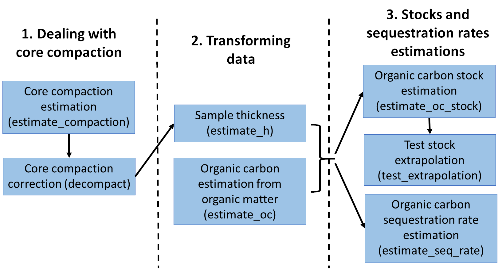

<!-- README.md is generated from README.Rmd. Please edit that file -->

# BlueCarbon <a href="https://ecologyr.github.io/BlueCarbon/"></a>

<!-- badges: start -->

[](https://cran.r-project.org/package=BlueCarbon)

[](https://github.com/EcologyR/BlueCarbon/actions/workflows/R-CMD-check.yaml)
[](https://app.codecov.io/gh/EcologyR/BlueCarbon)
[](https://lifecycle.r-lib.org/articles/stages.html#stable)
[](https://www.repostatus.org/#active)
[](https://cran.r-project.org/package=BlueCarbon)

<!-- badges: end -->

The goal of BlueCarbon is to facilitate the estimation of organic carbon
stocks and sequestration rates from soil/sediment cores from blue carbon
ecosystems. Following the protocols published by the Blue Carbon
initiative [Howard et
al. (2014)](https://www.cifor-icraf.org/knowledge/publication/5095/).

It includes seven main
[functions](https://ecologyr.github.io/BlueCarbon/reference/index.html)
to (1) estimate core compaction, (2) correct core compaction, (3)
estimate sample thickness, (4) estimate organic carbon content from
organic matter content, (5) estimate organic carbon stocks and (6)
sequestration rates, and (7) visualize the error in stock extrapolation.

<figure>

<figcaption aria-hidden="true">Blue Carbon package workflow</figcaption>
</figure>

#### ***estimate_compaction*** **- Estimate Core Compaction**

Sampling soil cores by manual percussion often results in the compaction
of the material retrieved. This function (`estimate_compaction()`)
estimates the percentage of compaction using measurements taken before
and after inserting the corer tube (Fig. 2): the length of the corer
tube (sampler_length), distance between the surface of the soil and the
top of the tube in the outside (external_distance) and distance between
the surface of the soil and the top of the tube in the inside of the
tube (internal_distance).

<figure>

<figcaption aria-hidden="true">Soil compaction from field
sampling</figcaption>
</figure>

#### ***decompact*** **- Calculate sediment properties after decompaction**

Core compaction derived from field extraction can be mathematically
corrected to estimate the original depth of the samples. This function
(`decompact()`) applies a linear correction (assuming uniform compaction
of the core material) to adjust the sample depth accurately. If dry bulk
density data is provided, the function also corrects it accordingly.

#### ***estimate_oc*** **- Organic carbon % estimation from organic matter %**

There is a linear correlation between organic carbon and organic matter
content. This correlation can vary across ecosystems and sampling sites.
This function (`estimate_oc()`) fits a linear regression model between
organic matter and organic carbon content of the samples and predicts
organic carbon values for samples where the latter information is
missing. Estimation of organic carbon is performed using a linear
regression between the logarithm of the organic carbon content and the
logarithm of the organic matter content (log(organic carbon) \\
log(organic matter)), providing an organic carbon value for each organic
matter value. It fits a model for each sampling station, dominant
species, and ecosystem. If an organic carbon value is already available
for a sample, the function returns it. Otherwise, it applies the model
for the corresponding sampling station. If a model cannot be fitted for
that station (e.g. because of limited sample size) or if the model fit
is poor, the function instead applies the model for the dominant
species. If no suitable species-level model exists, it then applies the
ecosystem-level model. If no models are available at any of these
levels, the function defaults to published models: [Fourqurean et
al. (2012)](https://doi.org/10.1038/ngeo1477) for seagrasses, [Maxwell
et al. (2023)](https://doi.org/10.1038/s41597-023-02633-x) for salt
marshes, and [Piñeiro-Juncal et
al. (2025)](https://doi.org/10.1038/s43247-025-02390-2) for mangroves.
It is unlikely, but possible, that the model predicts higher organic
carbon than organic matter content. If this occurs, the function issues
a warning, and it is recommended to discard that model.

#### ***estimate_h*** **- Sample thickness estimation**

For cores where only selected samples were measured, it is necessary to
assign a carbon density to the unmeasured sections before estimating the
total stock. This function (`estimate_h()`) identifies gaps between
samples and, if any are present, divides the space between the previous
and next sample, ensuring continuous samples without gaps in the core
(Fig. 3). The midpoint between two consecutive samples is estimated from
the bottom of the previous sample to the top of the next sample,
preventing the uneven distribution of gaps between samples with
different thickness. The stock and sequestration rate estimation
functions (`estimate_oc_stock()` and `estimate_seq_rate()`) already
incorporate this function, so there is no need to run it separately.

<figure>

<figcaption aria-hidden="true">Gap distribution between samples to
estimate accumulated organic carbon mass</figcaption>
</figure>

#### ***estimate_oc_stock*** **- Organic carbon stock estimation**

Estimates carbon stocks from soil core data down to a specified depth,
with 100 as the default. If the core does not reach the desired depth,
the function extrapolates the stock using a linear model based on the
relationship between accumulated organic carbon mass and depth. In this
model, accumulated organic carbon mass (stock) is the target variable
and depth the explanatory variable (lm(accumulated organic carbon mass ~
depth)). Therefore, this function will always provide either a estimated
stock (if the core reaches the desired depth) or a predicted stock (if
not). However, if the max depth of the core and the desired depth differ
greatly, this predicted depth could differ greatly from the real stock.
We recommend that, if possible, the users use the function
`test_extrapolation()` to assess the error of this extrapolation, and
that they clearly indicate the maximum depth of the cores in the methods
section of the resulting research outputs.

<figure>

<figcaption aria-hidden="true">Organic carbon stock estimation
diagram</figcaption>
</figure>

#### ***test_extrapolation*** **- Visualize the error of stock extrapolation**

This function subset the cores that reach the desired depth, estimates
the observed stock, and estimates the stock using the linear model on
the relationship between accumulated organic carbon mass and depth.
Extrapolations are performed using the top 90, 75, 50 and 25% length of
the specified depth. The function then compares the observed stock with
the extrapolated stock estimates. Note that this function requires that
at least some cores reach the desired depth.

#### ***estimate_seq_rate*** **- Organic carbon sequestration rates estimation**

Estimates the average organic carbon sequestration rate in the soil over
a specified time frame (by default 100). The average sequestration rate
is calculated by dividing the stock at the depth corresponding to the
target time frame by the length of the time frame itself.

## Installation

BlueCarbon can be installed directly from
[CRAN](https://cran.r-project.org/package=BlueCarbon):

``` r
install.packages("BlueCarbon")
```

or from [R-universe](https://ecologyr.r-universe.dev/BlueCarbon):

``` r
install.packages("BlueCarbon", repos = c("https://ecologyr.r-universe.dev", "https://cloud.r-project.org"))
```

Or from [GitHub](https://github.com/EcologyR/BlueCarbon):

``` r
# install.packages("remotes")
remotes::install_github("EcologyR/BlueCarbon")
```

## Citation

If using this package, please cite it:

``` r
citation("BlueCarbon")
To cite package 'BlueCarbon' in publications use:

  Piñeiro-Juncal N, Astigarraga J, Costa V, Martins M,
  Rodriguez-Sanchez F (2024). _BlueCarbon: Estimation of Organic Carbon
  Stocks and Sequestration Rates From Soil Core Data_. R package
  version 0.0.1, https://EcologyR.github.io/BlueCarbon/,
  <https://github.com/EcologyR/BlueCarbon>.

A BibTeX entry for LaTeX users is

  @Manual{,
    title = {BlueCarbon: Estimation of Organic Carbon Stocks and Sequestration Rates From Soil Core Data},
    author = {Nerea Piñeiro-Juncal and Julen Astigarraga and Valentina Costa and Marcio Martins and Francisco Rodriguez-Sanchez},
    year = {2024},
    url = {https://github.com/EcologyR/BlueCarbon},
    note = {R package version 0.0.1, https://EcologyR.github.io/BlueCarbon/},
  }
```

## Code of Conduct

Please note that the BlueCarbon project is released with a [Contributor
Code of
Conduct](https://ecologyr.github.io/BlueCarbon/CODE_OF_CONDUCT.html). By
contributing to this project, you agree to abide by its terms.

## Funding

The development of this software has been funded by Fondo Europeo de
Desarrollo Regional (FEDER) and Consejería de Transformación Económica,
Industria, Conocimiento y Universidades of Junta de Andalucía (project
US-1381388 led by Francisco Rodríguez Sánchez, Universidad de Sevilla).
NPJ was supported by a Juan de la Cierva fellowship (JDC2022-048342-I,
MCIN/AEI/10.13039/501100011033, European Union
“NextGenerationEU”/PRTR”). JA acknowledges funding from the CLIMB-FOREST
Horizon Europe Project (No 101059888) funded by the European Union. FRS
was supported by VI PPIT-US from Universidad de Sevilla. MM was
supported by a FCT PhD grant (<https://doi.org/10.54499/2020.06996.BD>).


