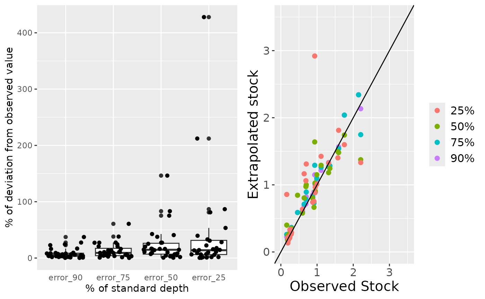

# BlueCarbon Tutorial

The BlueCarbon library has seven functions to estimate carbon stocks and
sequestration rates from raw laboratory data. Each function covers a
different step in the analysis workflow and can be used either
individually, by users interested in specific calculations, or together
as part of a complete workflow.

In this vignette we will use the example data from the BlueCarbon
library to estimate the organic carbon stocks in the first 75 cm and 1
meter of the soil and the average organic carbon sequestration rates of
these soils in the last 100 and 200 years.

## Load example data

``` r
library(BlueCarbon)
```

The first dataframe
([`core_comp`](https://ecologyr.github.io/BlueCarbon/reference/core_comp.html))
has field measurement data that we will use to estimate soil compaction
at core collection.

The second dataframe
([`bluecarbon_data`](https://ecologyr.github.io/BlueCarbon/reference/bluecarbon_data.html))
has core field information and laboratory data that we will use to
correct core compaction, estimate organic carbon content in each sample
from organic matter content, and to estimate the organic carbon stocks
and sequestration rates.

The core field information and laboratory data includes: sampling site,
core ID, type of blue carbon ecosystem, dominant species, core
compaction percentage, sample minimum depth, sample maximum depth, dry
bulk density, organic matter content and (if available) organic carbon
content and sample age.

## Core compaction estimation

Many field methods to extract soil cores can lead to the compaction of
the material retrieved (e.g. manual percussion).


The compaction percentage can be estimated knowing the difference
between the original surface level of the soil and the surface level of
the soil within the sampler after core insertion and before retrieval.
All distances in the example data are provided in cm. Distances can be
provided in any units, as long as they are the same for all of them.

``` r
compaction <- estimate_compaction(core_comp,
                                  core = "core",
                                  sampler_length = "sampler_length",
                                  internal_distance = "internal_distance",
                                  external_distance = "external_distance")
#> Warning in estimate_compaction(core_comp, core = "core", sampler_length =
#> "sampler_length", : Removing cores with missing data: Sm_03_04
```

We got a warning about one core, core Sm_03_04, that has been removed
from the final dataframe, as there was missing data. We can look at this
core in the example data to see which data was missing.

``` r
core_comp[core_comp$core == "Sm_03_04",]
#>        core sampler_length internal_distance external_distance
#> 30 Sm_03_04             NA                NA                NA
```

In this case, core Sm_03_04 didn’t have data about any of the three
variables needed. Below are the first 10 rows of the resulting
dataframe, including a column with the core compaction percentages.

``` r
head(compaction, n = 10)
#>        core sampler_length internal_distance external_distance compaction
#> 1  Sg_01_01            200                35                25   5.714286
#> 2  Sg_01_02            200                45                35   6.060606
#> 3  Sg_01_03            200                86                76   8.064516
#> 4  Sg_02_01            200                10                 0   5.000000
#> 5  Sg_02_02            200                60                50   6.666667
#> 6  Sg_02_03            200                78                68   7.575758
#> 7  Sg_03_01            200                52                42   6.329114
#> 8  Sg_03_02            200                 1                 1   0.000000
#> 9  Sg_03_03            200                98                78  16.393443
#> 10 Sg_04_01            200                21                 1  10.050251
```

## Decompact cores

Core compaction does not affect the final stock of the core. However, it
does affect the depth of the core samples. As stocks are given until a
known soil depth (e.g. the first meter) to be able to compare among
areas, the depth of the samples is needed to properly estimate the final
stock.

We use the function
[`decompact()`](https://ecologyr.github.io/BlueCarbon/reference/decompact.md)
to estimate the decompacted minimum and maximum depth of each sample
before stock estimation. Furthermore, as compaction reduces the volume
of the samples, dry bulk density has to be corrected. This can be done
by estimating the corrected volume by: multiplying the corrected
thickness of the sample (corrected maximum depth - corrected minimum
depth) by the area of the core; or, if compacted dry bulk density is
provided, function
[`decompact()`](https://ecologyr.github.io/BlueCarbon/reference/decompact.md)
will correct it. To provide compacted dry bulk density, the name of that
column has to be specified in the function parameter “dbd” as, by
default, this parameter is NULL and the function assumes that it was not
provided. Sample depths and dry bulk density are provided in cm and g
cm⁻³. Depths and dry bulk density can be provided in any units, as long
as they are the same for all of them.

[`decompact()`](https://ecologyr.github.io/BlueCarbon/reference/decompact.md)
has 6 parameters:

- “df”: data.frame with core properties

- “core”: (character) Name of the column with the id of the core to
  which the sample belongs

- “compaction”: (character) Name of the column with core compaction IN
  PERCENTAGE, as calculated with
  [`estimate_compaction()`](https://ecologyr.github.io/BlueCarbon/reference/estimate_compaction.md).

- “mind”: (character) Name of the column with minimum depth of the
  sample (depth at the top of the sample)

- “maxd”: (character) Name of the column with maximum depth of the
  sample (depth at the bottom of the sample)

- “dbd”: (character) Name of the column with dry bulk density

Here we don’t need to specify the name of the columns as in the example
data the names are the same as the default names in the function. But we
DO need to specify the dry bulk density column name as by default this
argument is NULL.

``` r
bluecarbon_decompact <- decompact(bluecarbon_data, dbd = "dbd")
#> Warning in decompact(bluecarbon_data, dbd = "dbd"): Setting compaction = 0 for
#> these cores: Sm_03_04, Sg_10_02, Sg_11_03, Sm_05_01, Sm_06_01
```

The warning has given a list of cores that have no compaction percentage
data. The function assumes that these cores were not compacted in the
field and sets compaction to zero.

Here are the first 10 rows of the final dataframe, with corrected
minimum and maximum sample depth and dry bulk density.

``` r
head(bluecarbon_decompact, n = 10) |> 
  table()
#> < table of extent 1 x 1 x 1 x 1 x 1 x 10 x 10 x 10 x 5 x 0 x 10 x 10 x 10 x 10 >
```

## Estimation of organic carbon % from organic matter %

There is a well-known linear relation between organic matter and organic
carbon content in soils. This correlation can change between ecosystems
and sampling sites due to changes in organic matter composition among
other factors. Therefore, it is recommended to estimate this correlation
for each batch of samples.

The
[`estimate_oc()`](https://ecologyr.github.io/BlueCarbon/reference/estimate_oc.md)
function estimates the content of organic carbon for those samples where
there are no organic carbon values but there is organic matter values.
Estimation of organic carbon is done by means of linear regressions on
log(organic carbon) ~ log(organic matter). The function returns an
organic carbon value for each organic matter value provided. If there is
a value for organic carbon for that sample it returns the same value;
otherwise, it estimates organic carbon from a model fitted to that site,
or a model fitted to that species, or else a model fitted to that
ecosystem. If there are too few samples with values of organic matter
content to build a reliable model or the model fit is too poor,
[`estimate_oc()`](https://ecologyr.github.io/BlueCarbon/reference/estimate_oc.md)
uses the equations in [Fourqurean et
al. (2012)](https://doi.org/10.1038/ngeo1477) for seagrasses, [Maxwell
et al. (2023)](https://doi.org/10.1038/s41597-023-02633-x) for salt
marshes and [Piñeiro-Juncal et
al. (2025)](https://doi.org/10.1038/s43247-025-02390-2) for mangroves to
estimate the organic carbon.

It is unlikely, but possible, that a model predicts higher organic
carbon than organic matter content. As this is not possible in nature,
the function will give a warning and it is recommended to discard that
model.

The function
[`estimate_oc()`](https://ecologyr.github.io/BlueCarbon/reference/estimate_oc.md)
has 7 parameters:

- “df”: A tibble or data.frame containing all the data. Must have at
  least five columns (see arguments below).

- “core”: (character) Name of the column with the id of the core to
  which the sample belongs

- “site”: (character) Name of the column reporting sample site.

- “ecosystem”: (character) Name of the column reporting ecosystem type.
  To apply published equations for OC estimation, ecosystem names should
  be either “Salt Marsh”, “Seagrass” or “Mangrove”.

- “species”: (character) Name of the column reporting the main species
  in the site.

- “om”: (character) Name of the column reporting organic matter values.

- “oc”: (character) Name of the column reporting organic carbon values.

Here we don’t need to specify the name of the columns as in the example
data the names are the same as the default names.

``` r
oc_out <- estimate_oc(bluecarbon_decompact)
```


    #> Warning in estimate_oc(bluecarbon_decompact): The following cores had samples
    #> with organic carbon values below the organic carbon range used to built the
    #> model: Sg_04_01, Sm_04_03, Sm_04_04, Sm_05_01
    #> Warning in estimate_oc(bluecarbon_decompact): The following cores had samples
    #> with organic carbon values above the organic carbon range used to built the
    #> model: Sg_04_01, Sm_03_01, Sm_04_02, Sm_04_03, Sm_04_04, Sm_05_01

The
[`estimate_oc()`](https://ecologyr.github.io/BlueCarbon/reference/estimate_oc.md)
function produces a plot showing the relationship between organic matter
and organic carbon content, and will provide warnings if any of the
samples had organic matter contents outside the percentage of organic
carbon in the samples used to estimate the models.

The function returns a list with two elements: \[1\] the original
dataframe with three new columns on the estimated organic carbon, the
standard error of the estimate, and the type of model used to estimate
the organic carbon value in that sample; and \[2\] a list of the models
estimated, for further inspection.

The OC values provided will have the same units as those provided
initially for the OC and OM columns. We recommend to work in percentage,
as the estimate_oc_stock() require OC values in percentages.

``` r
head(oc_out[[1]])  
#>    site     core ecosystem            species compaction mind maxd       dbd
#> 1 Sg_01 Sg_01_01  Seagrass Posidonia oceanica   5.714286    0    1 0.7352912
#> 2 Sg_01 Sg_01_01  Seagrass Posidonia oceanica   5.714286    1    2 0.9754336
#> 3 Sg_01 Sg_01_01  Seagrass Posidonia oceanica   5.714286    2    3 0.8698411
#> 4 Sg_01 Sg_01_01  Seagrass Posidonia oceanica   5.714286    3    4 1.0272564
#> 5 Sg_01 Sg_01_01  Seagrass Posidonia oceanica   5.714286    4    5 0.9307887
#> 6 Sg_01 Sg_01_01  Seagrass Posidonia oceanica   5.714286    5    6 1.4696196
#>         om oc age mind_corrected maxd_corrected dbd_corrected      eoc
#> 1 6.554329 NA   8       0.000000       1.060606     0.6932745 2.296034
#> 2       NA NA  13       1.060606       2.121212     0.9196945       NA
#> 3 7.382634 NA  15       2.121212       3.181818     0.8201359 2.566545
#> 4       NA NA  22       3.181818       4.242424     0.9685560       NA
#> 5 8.026646 NA  29       4.242424       5.303030     0.8776007 2.775515
#> 6       NA NA  35       5.303030       6.363636     1.3856413       NA
#>       eoc_se           origin
#> 1 0.04585142 Model by species
#> 2         NA             <NA>
#> 3 0.05166124 Model by species
#> 4         NA             <NA>
#> 5 0.05591166 Model by species
#> 6         NA             <NA>
```

``` r
head(oc_out[[2]], n = 2)
#> $Mangrove
#> $Mangrove$ecosystem_model
#> NULL
#> 
#> $Mangrove$multispecies_model
#> NULL
#> 
#> $Mangrove$site_models
#> NULL
#> 
#> 
#> $`Salt Marsh`
#> $`Salt Marsh`$ecosystem_model
#> 
#> Call:
#> stats::lm(formula = log(oc_r) ~ log(om_r), data = df)
#> 
#> Coefficients:
#> (Intercept)    log(om_r)  
#>      -1.667        1.077  
#> 
#> 
#> $`Salt Marsh`$multispecies_model
#> 
#> Call:
#> stats::lm(formula = log(oc_r) ~ log(om_r) * species_r, data = df)
#> 
#> Coefficients:
#>                          (Intercept)                             log(om_r)  
#>                              -1.9154                                1.1678  
#>           species_rSpartina maritima  log(om_r):species_rSpartina maritima  
#>                               1.0662                               -0.4614  
#> 
#> 
#> $`Salt Marsh`$site_models
#> $`Salt Marsh`$site_models$Sm_01
#> 
#> Call:
#> stats::lm(formula = log(oc_r) ~ log(om_r), data = df)
#> 
#> Coefficients:
#> (Intercept)    log(om_r)  
#>     -0.8492       0.7064  
#> 
#> 
#> $`Salt Marsh`$site_models$Sm_02
#> 
#> Call:
#> stats::lm(formula = log(oc_r) ~ log(om_r), data = df)
#> 
#> Coefficients:
#> (Intercept)    log(om_r)  
#>      -2.281        1.484  
#> 
#> 
#> $`Salt Marsh`$site_models$Sm_03
#> 
#> Call:
#> stats::lm(formula = log(oc_r) ~ log(om_r), data = df)
#> 
#> Coefficients:
#> (Intercept)    log(om_r)  
#>      -1.892        1.121
```

## Estimation of organic carbon stocks at 1m and 75 cm depth

The organic carbon stock is the accumulated organic carbon mass until a
provided depth per unit area. The default depth of function
[`estimate_oc_stock()`](https://ecologyr.github.io/BlueCarbon/reference/estimate_oc_stock.md)
is 100. If the depth of the samples is provided in cm (as in the example
data) this will correspond with 1 meter. If the core does not reach the
desired depth (standardization depth), it extrapolates the stock to that
depth from a linear model between accumulated mass of organic carbon and
depth.

The organic carbon mass of each sample is estimated as:

OC=DBD\*(OC%/100)\*h (Equation 1)

where DBD is the dry bulk density, OC% the organic carbon content in
percentage (as calculated with function
[`estimate_oc()`](https://ecologyr.github.io/BlueCarbon/reference/estimate_oc.md)
or provided by the user) and h the thickness of the sample (maximum
depth of the sample - minimum depth of the sample).

It is common to analyze only selected samples of a core to reduce
workload and analytic costs. Therefore, it is necessary to estimate the
organic carbon mass in the spaces between samples to estimate the
accumulated organic carbon mass. The function
[`estimate_h()`](https://ecologyr.github.io/BlueCarbon/reference/estimate_h.md)
distributes these empty spaces between the adjacent samples. This allows
to account for both different sample thickness and different spacing
between samples. Then, the organic carbon mass of that sample will be
estimated following equation 1 with the corrected sample thickness.


Distribution of empty spaces between samples by estimate_h() function

The function
[`estimate_h()`](https://ecologyr.github.io/BlueCarbon/reference/estimate_h.md)
is already incorporated within functions
[`estimate_oc_stock()`](https://ecologyr.github.io/BlueCarbon/reference/estimate_oc_stock.md),
[`test_extrapolation()`](https://ecologyr.github.io/BlueCarbon/reference/test_extrapolation.md)
and
[`estimate_seq_rate()`](https://ecologyr.github.io/BlueCarbon/reference/estimate_seq_rate.md),
and there is no need to run it beforehand. Sample depths in the example
dataset is provided in cm.

function
[`estimate_oc_stock()`](https://ecologyr.github.io/BlueCarbon/reference/estimate_oc_stock.md)
has 7 parameters:

- “df”: A data.frame with core (core id), mind (minimum depth of the
  sample), maxd (maximum depth of the sample), dbd (dry bulk density),
  oc (organic carbon %)

- “depth”: Numeric Maximum depth to estimate the stock, by default 100.

- “core”: Character Name of the column reporting core ID.

- “mind”: Character Name of the column reporting the minimum depth of
  each sample.

- “maxd”: Character Name of the column reporting the maximum depth of
  each sample.

- “dbd”: Character Name of the column reporting dry bulk density.

- “oc”: Character Name of the column reporting organic carbon
  concentrations.

We used the output from
[`estimate_oc()`](https://ecologyr.github.io/BlueCarbon/reference/estimate_oc.md)
to estimate the organic carbon stock per cm² up to 1m depth. As the
column names from the
[`estimate_oc()`](https://ecologyr.github.io/BlueCarbon/reference/estimate_oc.md)
output are the same as the default names in
[`estimate_oc_stock()`](https://ecologyr.github.io/BlueCarbon/reference/estimate_oc_stock.md)
we don’t need to specify them. Furthermore, the default depth is 100,
and our data is in cm so we don’t need to specify the depth (i.e. will
estimate carbon stock down to 1m depth).

``` r
stocks <- estimate_oc_stock(oc_out[[1]])
```

The output of this function is a dataframe with 5 columns. The first
column is the core ID. The second column (`stockwc`) is the carbon stock
in the whole core. The third column is the maximum depth of that core.
The fourth column is the stock down to the standardization depth.
Finally, if the core didn’t reach the standardization depth, we will get
a value in the fifth column with the standard error of the accumulated
mass-depth model used to estimate the stock.

``` r
head(stocks, n=10)
#>        core    stockwc      maxd     stock    stock_se
#> 1  Sg_01_01 2.62947377 156.96970 1.8551331          NA
#> 2  Sg_01_02 2.37997169  78.34839 2.9938578 0.092740541
#> 3  Sg_01_03 2.08002346  99.63509 2.1763784 0.069382436
#> 4  Sg_02_01 2.06631095 124.21053 1.6774846          NA
#> 5  Sg_02_02 0.06798487  23.14286 0.3099306 0.015373325
#> 6  Sg_02_03 0.93076430  55.82951 1.6394040 0.055765031
#> 7  Sg_03_01 0.17284439  48.04054 0.3532540 0.007802834
#> 8  Sg_03_02 0.19106567  35.80000 0.5485867 0.021102396
#> 9  Sg_03_03 0.17326199  60.76078 0.3048915 0.021924873
#> 10 Sg_04_01 0.97516409  95.60894 1.1414566 0.055859866
```

The stock units are mass/area to a depth (length). The actual units will
depend on those provided in the original dataframe. In the example data
(`bluecarbon_data`), the carbon mass will be in g and the area cm⁻² (as
the dry bulk density was in g cm⁻³) and the depth will be 100 cm, as the
minimum and maximum depth of the samples was in cm. So the units for the
estimated carbon stock in this case are **g/cm⁻² in the top 100 cm**.

To estimate the stock to a depth different than 100 cm, we have to
specify it in the parameter “depth”. For example, to estimate the carbon
stock down to 75 cm:

``` r
stocks75 <- estimate_oc_stock(oc_out[[1]], depth = 75)
```

``` r
head(stocks75, n = 10)
#>        core    stockwc      maxd     stock    stock_se
#> 1  Sg_01_01 2.62947377 156.96970 1.5957092          NA
#> 2  Sg_01_02 2.37997169  78.34839 2.2059969          NA
#> 3  Sg_01_03 2.08002346  99.63509 1.7547894          NA
#> 4  Sg_02_01 2.06631095 124.21053 1.3186908          NA
#> 5  Sg_02_02 0.06798487  23.14286 0.2306065 0.011009091
#> 6  Sg_02_03 0.93076430  55.82951 1.2240241 0.038709351
#> 7  Sg_03_01 0.17284439  48.04054 0.2721119 0.005376076
#> 8  Sg_03_02 0.19106567  35.80000 0.4083799 0.014856354
#> 9  Sg_03_03 0.17326199  60.76078 0.2292955 0.015143971
#> 10 Sg_04_01 0.97516409  95.60894 0.9352101          NA
```

## Test stock extrapolation

With this function
([`test_extrapolation()`](https://ecologyr.github.io/BlueCarbon/reference/test_extrapolation.md))
we can visualize the amount of error that may be introduced by
extrapolating carbon stocks of short cores to a deeper standardization
depth. This function uses those cores that reach the desired depth and
tests what would be the error in the estimated carbon stock if we were
to model it from the 90, 75, 50 and 25% of that depth. This function
subsets the cores that reach the desired depth, estimates the complete
stock (observed stock) to indicated desired depth, model the stock using
observed data within 90, 75, 50 and 25% of the total observed depth
estimates the stock from the linear relation of organic carbon
accumulated mass and depth using the 90, 75, 50 and 25% length of the
indicated desired depth, and compares the observed stock with the stocks
estimated by extrapolation. IT DOES NOT provide the error for those
cores modeled by the function
[`estimate_oc_stock()`](https://ecologyr.github.io/BlueCarbon/reference/estimate_oc_stock.md)
as that function models those cores that do not reach the desired depth.
This function requires that some of your cores do reach the desired
depth.

function
[`test_extrapolation()`](https://ecologyr.github.io/BlueCarbon/reference/test_extrapolation.md)
has 7 parameters:

- “df”: A data.frame with core (core id), mind (minimum depth of the
  sample), maxd (maximum depth of the sample), dbd (dry bulk density),
  oc (organic carbon %)

- “depth”: Numeric Maximum depth to estimate the stock, by default 100.

- “core”: Character Name of the column reporting core ID.

- “mind”: Character Name of the column reporting the minimum depth of
  each sample.

- “maxd”: Character Name of the column reporting the maximum depth of
  each sample.

- “dbd”: Character Name of the column reporting dry bulk density.

- “oc”: Character Name of the column reporting organic carbon
  concentrations.

As in the
[`estimate_oc_stock()`](https://ecologyr.github.io/BlueCarbon/reference/estimate_oc_stock.md)
example, we used the output from
[`estimate_oc()`](https://ecologyr.github.io/BlueCarbon/reference/estimate_oc.md)
to estimate the organic carbon stock per cm² up to 1m depth. As the
column names from the
[`estimate_oc()`](https://ecologyr.github.io/BlueCarbon/reference/estimate_oc.md)
output are the same as the default names in
[`estimate_oc_stock()`](https://ecologyr.github.io/BlueCarbon/reference/estimate_oc_stock.md)
we don’t need to specify them. Furthermore, the default depth is 100,
and our data is in cm so we don’t need to specify the depth.

``` r
stocks_test <- test_extrapolation(oc_out[[1]])
#> Warning: Removed 4 rows containing non-finite outside the scale range
#> (`stat_boxplot()`).
#> Warning: Removed 4 rows containing missing values or values outside the scale range
#> (`geom_point()`).
#> Warning: Removed 1 row containing missing values or values outside the scale range
#> (`geom_point()`).
#> Warning: Removed 3 rows containing missing values or values outside the scale range
#> (`geom_point()`).
```



This function returns a dataframe with observed and extrapolated stocks,
and two plots. The first plot (left) shows the deviation of the
extrapolated stock from the observed stock, in percentage of the
observed stock. The second plot (right) shows the distribution of the
extrapolated and observed stocks. The diagonal line indicate that both
stocks are equal. Above that line, the extrapolated stock was
overestimated; below the line, the extrapolated stock was
underestimated.

The same can be done for a different depth. Like in the example of
[`estimate_oc_stock()`](https://ecologyr.github.io/BlueCarbon/reference/estimate_oc_stock.md)
we use 75 by modifying the parameter “depth”.

``` r
stocks_test <- test_extrapolation(oc_out[[1]], depth = 75)
#> Warning: Removed 5 rows containing non-finite outside the scale range
#> (`stat_boxplot()`).
#> Warning: Removed 5 rows containing missing values or values outside the scale range
#> (`geom_point()`).
#> Warning: Removed 1 row containing missing values or values outside the scale range
#> (`geom_point()`).
#> Warning: Removed 4 rows containing missing values or values outside the scale range
#> (`geom_point()`).
```


## Estimate soil organic carbon sequestration rates

In depositional environments, like seagrass meadows, salt marshes and
mangroves forests, it is possible to estimate the sediment accretion
rate of the cores, as long as the sedimentary record has not been mixed.
[`estimate_seq_rate()`](https://ecologyr.github.io/BlueCarbon/reference/estimate_seq_rate.md)
estimates the organic carbon sequestration rates of those cores that
have a coherent age-depth model. The age of each sample is included in a
column of the input dataframe (column “age” in the example dataframe).
The function will select those samples that have age data and delete
those without.

Estimations of organic carbon sequestration rates depend on the balance
between organic matter burial and degradation. Therefore, the longer the
time frame used to estimate the average sequestration rate, the lower
the estimated sequestration rate. To be able to compare among cores, all
sequestration rates must be standardized to the same time frame.

The function
[`estimate_seq_rate()`](https://ecologyr.github.io/BlueCarbon/reference/estimate_seq_rate.md)
estimates the average carbon sequestration rates for a known time frame
(100 by default) by summing the carbon stocks down to that age-depth and
dividing by the time frame. The timeframe always refers to the last
period of time (the last 100, the last 1000, etc…)

[`estimate_seq_rate()`](https://ecologyr.github.io/BlueCarbon/reference/estimate_seq_rate.md)
has 8 parameters:

- “df”: A data.frame with, at least, columns: core, mind (minimum depth
  of the sample), maxd (maximum depth of the sample), dbd (dry bulk
  density), oc (organic carbon %), age (age of the sample obtained from
  a age-depth or age-accumulated mass model)

- “timeframe”: Numeric Standardization time frame, by default 100 years

- “core”: Character Name of the column reporting core ID.

- “mind”: Character Name of the column reporting the minimum depth of
  each sample.

- “maxd”: Character Name of the column reporting the maximum depth of
  each sample.

- “dbd”: Character Name of the column reporting dry bulk density.

- “oc”: Character Name of the column reporting organic carbon
  concentrations.

- “age”: Character Name of the column reporting the age of each sample.

We use the output from
[`estimate_oc()`](https://ecologyr.github.io/BlueCarbon/reference/estimate_oc.md)
to estimate the organic carbon sequestration rate per cm² in the last
100 years. As the column names from the
[`estimate_oc()`](https://ecologyr.github.io/BlueCarbon/reference/estimate_oc.md)
output are the same as the default names in
[`estimate_seq_rate()`](https://ecologyr.github.io/BlueCarbon/reference/estimate_seq_rate.md)
we don’t need to specify them. Furthermore, the default time frame is
100.

``` r
seq_rate <- estimate_seq_rate(oc_out[[1]])
```

The output of this function is a dataframe with 4 columns. The first
column is the core ID. The second column is the average sequestration
rate in the whole core. The third column is the maximum age of that
core. The fourth column is the sequestration rate in the provided time
frame.

``` r
head(seq_rate, n=10)
#>        core  seq_rate_wc  maxage     seq_rate
#> 1  Sg_01_01 0.0020180152 1303.00 0.0043626875
#> 2  Sg_02_01 0.0005423388 3810.00 0.0027556600
#> 3  Sg_03_01 0.0001068260 1618.00 0.0002322665
#> 4  Sg_05_01 0.0023649409  422.00 0.0022770729
#> 5  Mg_01_01 0.0024467131  990.00 0.0040171986
#> 6  Sm_01_01 0.0009239537 1247.00 0.0012018703
#> 7  Sm_02_01 0.0003773279 3096.00 0.0013587956
#> 8  Sm_03_01 0.0012985371  592.00 0.0025806030
#> 9  Sg_06_01 0.0080307101  164.15 0.0069686883
#> 10 Sg_06_02 0.0021769458  776.50 0.0045876577
```

The sequestration rates units are mass/area by time (in the last xxx
units of time). The units will be those provided in the dataframe. In
the example data, mass will be g and the area cm⁻² (as the dry bulk
density was in g/cm⁻³) and both times will be in years, as the age of
the samples was in years. So, the sequestration rates units in this
example are **g/cm⁻² yr⁻¹ in the last 100 years**.

To estimate the organic carbon sequestration rate in a different
timeframe than 100, we have to specify it in the parameter “timeframe”.

``` r
seq_rate_200 <- estimate_seq_rate(oc_out[[1]], timeframe = 200)
#> Core Sg_06_01 is younger than the time frame provided
#> Core Sm_07_01 is younger than the time frame provided
#> Core Mg_02_01 is younger than the time frame provided
```

``` r
head(seq_rate_200, n=10)
#>        core  seq_rate_wc  maxage     seq_rate
#> 1  Sg_01_01 0.0020180152 1303.00 0.0036333524
#> 2  Sg_02_01 0.0005423388 3810.00 0.0017522040
#> 3  Sg_03_01 0.0001068260 1618.00 0.0001802125
#> 4  Sg_05_01 0.0023649409  422.00 0.0024636800
#> 5  Mg_01_01 0.0024467131  990.00 0.0027250712
#> 6  Sm_01_01 0.0009239537 1247.00 0.0010274819
#> 7  Sm_02_01 0.0003773279 3096.00 0.0007817402
#> 8  Sm_03_01 0.0012985371  592.00 0.0015549084
#> 9  Sg_06_01 0.0080307101  164.15           NA
#> 10 Sg_06_02 0.0021769458  776.50 0.0037439774
```
