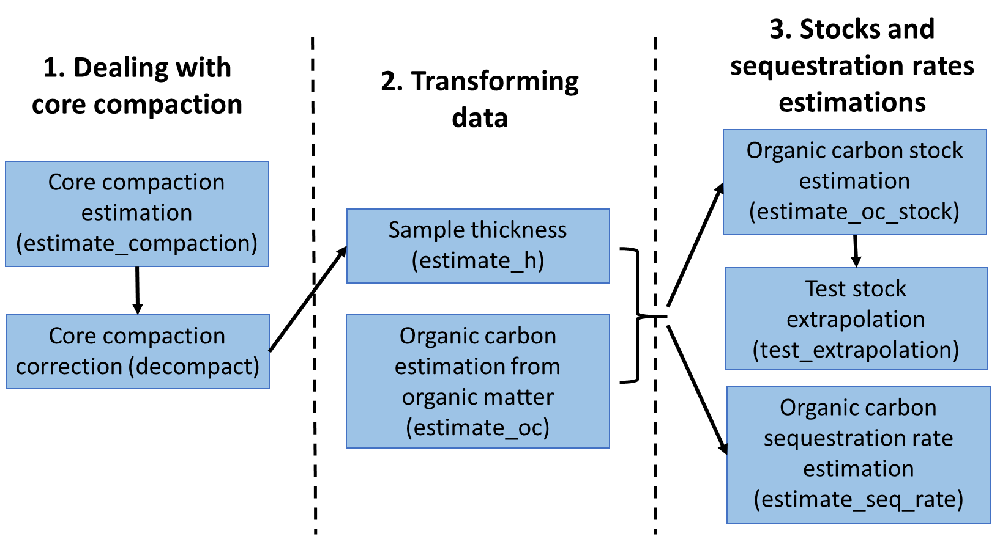
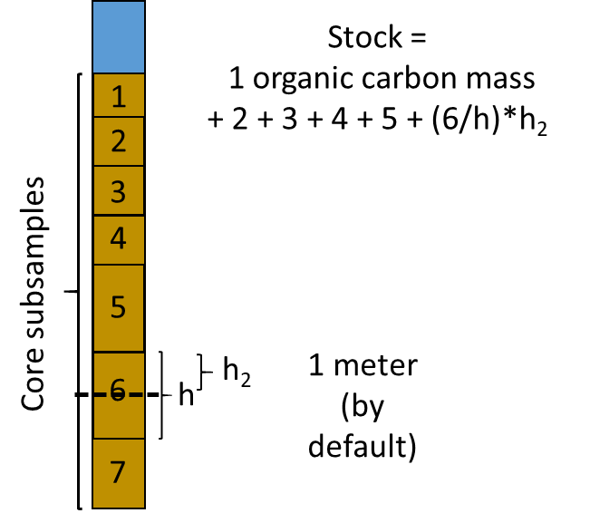

Correspondence:

Nerea Piñeiro-Juncal, University of Vigo, Vigo, Spain. Email: [np.juncal\@gmail.com](mailto:np.juncal@gmail.com){.email}

# Summary

*`BlueCarbon`* facilitates the estimation of organic carbon stocks and sequestration rates from soil and sediment cores in depositional environments. It includes seven main functions to (1) estimate core compaction, (2) correct core compaction, (3) estimate sample thickness, (4) estimate organic carbon content from organic matter content, (5) estimate organic carbon stocks and (6) sequestration rates, and (7) visualize the error in stock extrapolation.

```{r setup, include=FALSE, cache=FALSE, message = FALSE}
library("knitr")
### Chunk options: see http://yihui.name/knitr/options/ ###
## Text results
opts_chunk$set(echo = TRUE, warning = TRUE, message = FALSE, out.width = "100%")
## Code decoration
opts_chunk$set(tidy = TRUE, comment = NA, highlight = TRUE)
## Cache
opts_chunk$set(cache = TRUE, cache.path = "output/cache/")
## Plots
opts_chunk$set(fig.path = "output/figures/", dpi = 300)
```

# Statement of Need

Coastal blue carbon ecosystems have earned significant attention for their role as organic carbon sinks. Over the past decade, publications on blue carbon research have grown exponentially [@quevedo_2023]. While soil samples can be collected by different methods, estimation methodologies remain fairly homogeneous, following the protocols published by the Blue Carbon initiative [@Howard_2014]. Despite the increasing use of R among blue carbon researchers, there are no specialized R packages dedicated to these calculations. *`BlueCarbon`* aims to standardize and automate the main estimations for calculating  soil and sediment blue carbon stocks and sequestration rates from raw field and laboratory data.

# Design

*`BlueCarbon`* contains seven main functions (Fig. 1) to deal with core compaction (to estimate and mathematically correct core compaction), transform laboratory data (to estimate sample thickness and to estimate organic carbon content from organic matter content) and estimate organic carbon stocks and sequestration rates (estimate organic carbon stocks, sequestration rates, and visualizing the error in stock extrapolation).



#### ***estimate_compaction*** **- Estimate Core Compaction**

Sampling soil cores by manual percussion often results in the compaction of the material retrieved. This function estimates the percentage of compaction using measurements taken before and after inserting the corer tube (Fig. 2).

{width="337"}

#### ***decompact*** **- Calculate sediment properties after decompaction**

This function applies a linear correction (assuming uniform compaction of the core material) to adjust the sample depth accurately. If dry bulk density data is provided, the function also corrects it accordingly.

#### ***estimate_oc*** **- Organic carbon content estimation from organic carbon data**

There is a linear correlation between organic carbon and organic matter content. This correlation can vary across ecosystems and sampling sites. This function fits a linear regression model between organic matter and organic carbon content of the samples and predicts organic carbon values for samples where the latter information is missing. Estimation of organic carbon is performed using a linear regression between the logarithm of the organic carbon content and the logarithm of the organic matter content (log(organic carbon) \\\~ log(organic matter)), providing an organic carbon value for each organic matter value. It fits a model for each sampling station, dominant species, and ecosystem. If an organic carbon value is already available for a sample, the function returns it. Otherwise, it applies the model for the corresponding sampling station. If a model cannot be fitted for that station (e.g. because of limited sample size) or if the model fit is poor, the function instead applies the model for the dominant species. If no suitable species-level model exists, it then applies the ecosystem-level model. If no models are available at any of these levels, the function defaults to published models: @Fourqurean_2012 for seagrasses, @Maxwell_2023 for salt marshes, and @Piñeiro-Juncal for mangroves. It is unlikely, but possible, that the model predicts higher organic carbon than organic matter content. If this occurs, the function issues a warning, and it is recommended to discard that model.

#### ***estimate_h*** **- Sample thickness estimation**

For cores where only selected samples were measured, it is necessary to assign a carbon density to the unmeasured sections before estimating the total stock. This function identifies gaps between samples and, if any are present, divides the space between the previous and next sample, ensuring continuous samples without gaps in the core (Fig. 3). The midpoint between two consecutive samples is estimated from the bottom of the previous sample to the top of the next sample, preventing the uneven distribution of gaps between samples with different thickness. The stock and sequestration rate estimation functions (estimate_oc_stock and estimate_seq_rate) already incorporate this function, so there is no need to run it separately.

{width="268"}

#### ***estimate_oc_stock*** **- Organic carbon stock estimation**

Estimates carbon stocks from soil core data down to a specified depth, with 100 as the default. If the core does not reach the desired depth, the function extrapolates the stock using a linear model based on the relationship between accumulated organic carbon mass and depth. In this model, accumulated organic carbon mass (stock) is the target variable and depth the explanatory variable (lm(accumulated organic carbon mass \~ depth)).

{width="312"}

#### ***test_extrapolation*** **- Visualize the error of stock extrapolation**

This function subset the cores that reach the desired depth, estimates the observed stock, and estimates the stock using the linear model on the relationship between accumulated organic carbon mass and depth. Extrapolations are performed using the top 90, 75, 50 and 25% length of the specified depth. The function then compares the observed stock with the extrapolated stock estimates. Note that this function requires that at least some cores reach the desired depth.

#### ***estimate_seq_rate*** **- Organic carbon sequestration rates estimation**

Estimates the average organic carbon sequestration rate in the soil over a specified time frame (by default 100). The average sequestration rate is calculated by dividing the stock at the depth corresponding to the target time frame by the length of the time frame itself.

# Availability

BlueCarbon is available in [CRAN](https://cran.r-project.org/package=BlueCarbon). The package documentation and expanded tutorials can be accessed [here](https://ecologyr.github.io/BlueCarbon/). A recorded video of a workshop and step-by-step tutorial walkthrough is available [here](https://www.youtube.com/watch?v=XCrrR3_MSHc&ab_channel=EcoinformaticaAEET).

# Acknowledgements

The development of this software has been funded by Fondo Europeo de Desarrollo Regional (FEDER) and Consejería de Transformación Económica, Industria, Conocimiento y Universidades of Junta de Andalucía (project US-1381388 led by Francisco Rodríguez Sánchez, Universidad de Sevilla). NPJ was supported by a Juan de la Cierva fellowship (JDC2022-048342-I, MCIN/AEI/10.13039/501100011033, European Union “NextGenerationEU”/PRTR”). JA acknowledges funding from the CLIMB-FOREST Horizon Europe Project (No 101059888) funded by the European Union. FRS was supported by VI PPIT-US from Universidad de Sevilla. MM was supported by a FCT PhD grant (https://doi.org/10.54499/2020.06996.BD).

# References
